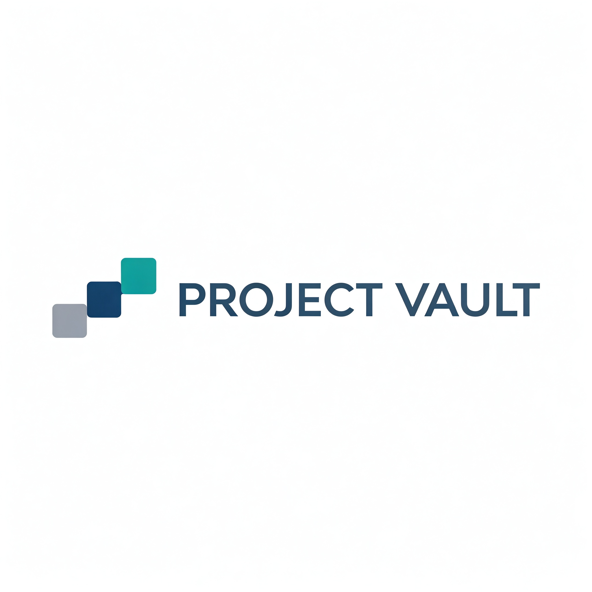
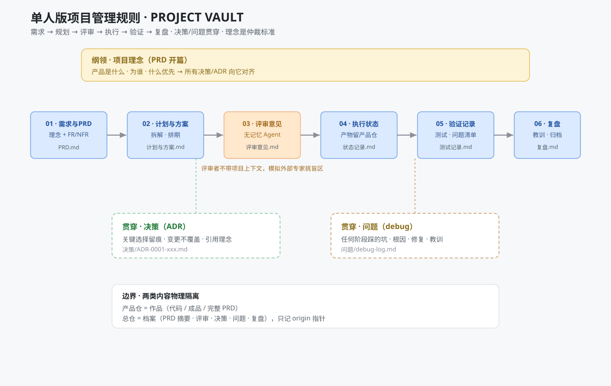

# 项目管理规则（project-vault-rules）



> 单人版项目管理规则开源版——从现实项目管理流程推演而来：**需求 → 规划 → 评审 → 执行 → 验证 → 复盘**，外加**决策 / 问题**两个贯穿夹。



## 这是什么

一套**给一个人管理多个项目**的管理规则与目录结构，解决三个痛点：

1. 管理资料散落在聊天记录 / 本地文件 / 产品仓库里，找不到、分不清；
2. 决策被反复推翻没有留痕，回头答不上"为什么是这样"；
3. 换会话 / 换 Agent 后进度丢失，同一问题反复论证。

## 规则怎么来的（设计逻辑）

1. 取业界通用项目管理流程（启动 / 规划 / 执行 / 监控 / 收尾 + 敏捷日常实践）；
2. 合并同类动作 → 多人版（需求 · 规划 · 评审 · 执行 · 测试修复 · 进度汇报 · 变更管理 · 验收 · 复盘）；
3. **删掉为"协作"而存在的环节**（进度汇报 → 状态字段；变更审批 → 决策留痕；评审团 → 无记忆 Agent 评审）→ **单人版**。

## 结构

```
project-vault-rules/
├── README.md        ← 本文件：门面
├── SKILL.md         ← Agent 加载协议（协议型 Skill 入口）
├── STANDARDS.md     ← 管理标准（正式规则）
└── TEMPLATES/       ← 9 个环节模板（PRD / 计划 / 评审 / 状态 / 验证 / 复盘 / ADR / debug / handoff）
```

项目目录结构（每个项目一套环节夹）：

```
<项目名>/
├── 01-需求与PRD/    PRD.md（理念开篇 + FR/NFR）
├── 02-计划与方案/   计划与方案.md
├── 03-评审意见/     YYYY-MM-DD-主题.md（无记忆 Agent 评审）
├── 04-执行状态/     状态记录.md · 交接文档.md（产物留产品仓，记进度指针；交接文档 = 新会话入口）
├── 05-验证记录/     测试记录 · 问题清单 · 自检报告
├── 06-复盘/         复盘.md
├── 决策/            ADR-0001-xxx.md（贯穿）
└── 问题/            debug-log.md（贯穿）
```

## 怎么用

- **人**：读 `STANDARDS.md` 了解规则，用 `TEMPLATES/` 落盘；各项目目录按环节夹推进。
- **Agent**：读 `SKILL.md` 加载协议 → 按 `STANDARDS.md` 执行 → 用模板落盘 → 更新状态与索引。

## 规则要点（详见 STANDARDS）

- **理念并入 PRD 开篇**：产品是什么 / 为谁 / 什么优先（决策准则）；ADR 决策必须引用理念。
- **无记忆 Agent 评审**：评审者不带项目上下文，模拟外部专家，专挑上下文盲区。
- **决策永不覆盖**：变更 = 新增 ADR，旧记录标 `superseded-by`。
- **产品仓边界**：总仓只存管理资料，代码 / 成品留产品仓，只记指针。
- **记忆与交接**：每项目 `04-执行状态/交接文档.md` 是新会话第一入口——现状 / 待拍板 / 下一步 / 产品仓指针；Agent 恢复上下文按「索引 → 交接文档 → 环节细节 → 产品仓」顺序读，不全局搜索对话记忆。
- **云端单一事实源**：管理资料上云后，所有 Agent 共享同一份进度，不各自为政（见下节）。

## 云端单一事实源（多 Agent 同步）

管理资料存放在私有总仓（`TEXXXXTURE/project-vault`），它同时是**云端单一事实源**：

- **为什么上云**：Agent 读云端仓库与读本地文件差异不大（都是拉取文件），但云端让所有 Agent 共享同一份事实——无论每个 Agent 的本地环境、工作目录或习惯位置如何，clone / pull 同一个仓库就读到同一份项目进度，不会出现"各 Agent 各有一份本地文件、互相分叉"。
- **读取**：`git clone` / `git pull`（推荐）；也可用 GitHub API（私有仓需 token 授权）。
- **写回**：更新以 `commit + push` 落到云端仓库为完成标志；本地副本只是工作区，冲突时以云端为准。
- **并行**：多个 Agent 同时工作时，一次只改自己负责的环节夹 / 文件、提交信息写明项目，即可避免互相覆盖。

## 关联仓库

- 真实项目资料：`TEXXXXTURE/project-vault`（**私有**，存各项目的 PRD / 评审 / 决策 / 问题等管理资料）。

## License

MIT
